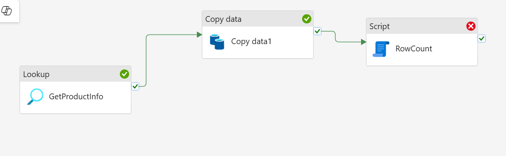

```
title: "Fabric Lakehouse Practical - Session 2"
date: 2025-09-23
tags: [#fabric-intro, #lakehouse, #pipelines, #semantic-models]
summary: Exploration of lakehouses and pipelines
```

# Pipeline - IngestCSV

Error referenced in Session 1:
```
The function 'length' expects its parameter to be an array or a string. The provided value is of type 'Object'.
```
Issue rectified by removing the **foreach** and configuring it as a simple data ingestion job, capturing data from a CSV, in bulk, and inserting that data into a table.

Tried adding a script option to use a RowCount to ensure that data has been recieved in the table. It is erroring with the below. 
```
Failed to convert the value in 'artifactId' property to 'System.String' type. Please make sure the payload structure and value are correct. Error message: Object must implement IConvertible..
```
The current pipeline looks like the following:


### Steps Completed/In Progress:
- Step 2: Pipelines 101

### <u>Next session Aim:</u>
Setup comprehensive error handling and validation throughout the pipeline steps (Finish Step 2); Begin Step 3 - Copy Job (Preview).