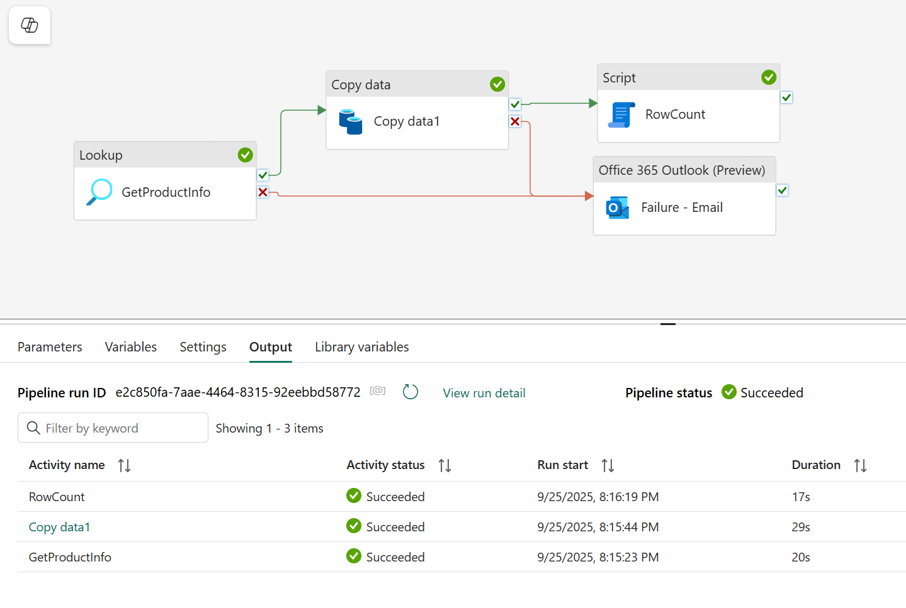

```
title: "Fabric Lakehouse Practical - Session 3"
date: 2025-09-25
tags: [#fabric-intro, #lakehouse, #pipelines, #semantic-models]
summary: Exploration of lakehouses and pipelines
```

# Pipeline - IngestCSV

### **Session Aim:** Setup comprehensive error handling and validation throughout the pipeline steps (Finish Step 2); Begin Step 3 - Copy Job (Preview).

Recitifying this error took longer than expected but managed it in the end. 

**Actions:**
- Created script activity
- Set connection to custom Azure SQL Database
- Set the Server to the LakeHouse connection string
- Set the database to Training_Lakehouse
- Wrote the Query to Take row count

I also setup an email function to send an email if the intial Lookup or Copy Data functions failed.

I found out that the LakeHouse SQL connection is only read so DDL statements are blocked/fail. It was suggested that I use a notebook to create a table/insert data.

The current Pipeline looks like the following:


I plan to write the DDL query in a notebook that allows me to log these run results to a table.

### <u>Next session Aim:</u>
Look at the capabilities of notebooks in relation to the DDL query and encoparte that into my pipeline. Take a step back from practicals and learn Data factory basics.