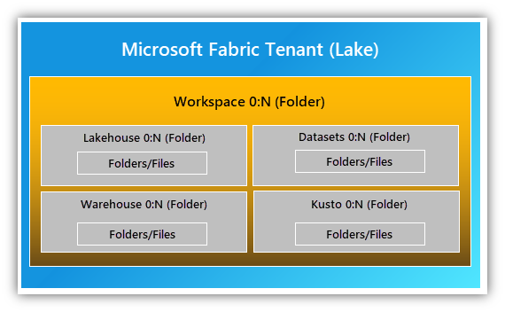
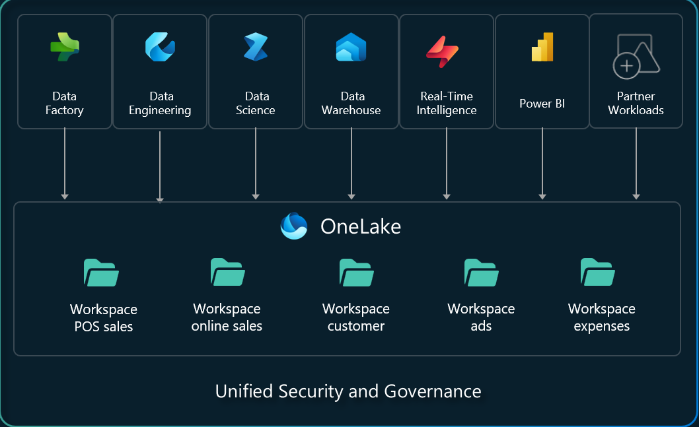

```
title: "Session 2: Fabric Introduction - OneLake and Fabric data flow"
date: 2025-09-08
content: Fabric Intro - (https://learn.microsoft.com/en-us/fabric/fundamentals/microsoft-fabric-overview)
         What is OneLake - (https://learn.microsoft.com/en-us/fabric/onelake/onelake-overview)
tags: [#fabric-intro]
summary: What is Fabric, What is OneLake, and how does data flow through Fabric?
```

# Fabric Introduction - OneLake, Fabric data flow

### **Session Intent:** Understand what OneLake is and how data typically flows through Fabric.

## What is OneLake?

A data lake is the foundation of all Fabric workloads. For Fabric, this is called OneLake. It's built into the platform and is a place for all organisational data. OneLake is built on ***ADLS (Azure Data Lake Storage) Gen2(?)***. It provides a single SaaS experience and a tenant-wide data store for professional and citizen developers. It simplifies the need to understand complex infrastructure details like resource groups, RBAC, Azure Resource Manager, redundancy, or regions.

Each tenant gets on unified OneLake with single file-system that spans users, regions and clouds. OneLake organises data into containers for easy handling. The tenant maps to the root of OneLake and is at the top level of the hierarchy. You can create multiple workspaces (like folders) within a tenant. The following shows how data is stored in OneLake:



Within a Tenant, you can create any number of workspaces. Different workspaces enable the organisation to distribute ownership and access policies. **Each workspace is part of a capacity that is tied to a specific region and is billed separately**. The following is a visual representation of how workspaces are accessed by fabric components and how everything is governed and secured holistically. 



As mentioned previously,  OneLake is built on **ADLS Gen2** and supports any type of file, structured and unstructured. All fabric data items i.e. data warehouses and lakehouses, store their data in ***Delta Parquet(?)*** format. If a data engineer loads data into a data lakehouse using Apache Spark and a SQL developer loads data into a data warehouse, they are both contributing to OneLake. **OneLake stores all Tabular data in a Delta Parquet format.**

OneLake supports the same **ADLS Gen2** APIs and SDKs to be compatible with existing **ADLS Gen2** applications, like Azure Databricks. You can address OneLake like an Azure storage account for the whole organisation. Every workspaces appears as different containers within that account and different data items appear as different folders within those containers.

### One copy of Data

OneLake aims to give you the most value out of a single copy of Data without data movement and duplication. You no longer need to copy data just to use it in another engine or to break down data silos so you can analyse data with data from other sources.

### Next session: Finish Basics to OneLake (Both learn articles) and begin data flow research.
