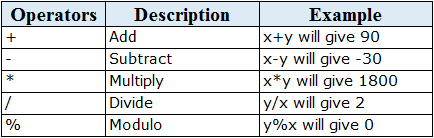
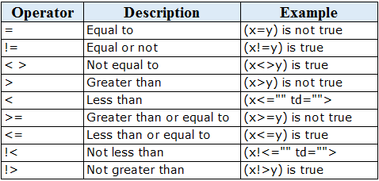

```
title: "Lecture 05: Operators, Expressions and Conditions"
date: 2025-09-08
course: Microsoft SQL Server Database Administation Course
tags: [#sql-basics, #sql-queries]
summary: How Operators, Expressions and Conditions are used in SQL Queries
```
# Operators, Expressions and Conditions 

## Types of Operators
### <u>Arithmetic</u>

### <u>Relational</u>

### <u>Logical</u>


## Expressions

An expression is a  combination of one or more values, conditions and SQL functions to evalulate to a value. They are used to query specific datasets froma database.

```
SELECT
    Column1,
    Column2,
    Column3...
FROM
    Table
WHERE
    [EXPRESSION | CONDITION];
```

## Types of Expressions

### SQL Boolean Expresions

```
SELECT *
FROM TableName
WHERE Column1 = 26
```
### SQL Numerical Expressions
```
SELECT *
FROM TableName
WHERE Column1*2 > 50;
```

### SQL Date Expressions

```
SELECT *
FROM TableName
WHERE Column1 > DATE('2000/01/01')
```

## Conditions

A condition specifies a combination of expressions or logical (Boolean) operators to provide a TRUE, FALSE or unknown value 

```
SELECT *
FROM TableName
WHERE (Column1 = 'Value1' AND Column2 = 'Value2')
OR (Column1 = 'Value3')
```
***--Lecture end--***