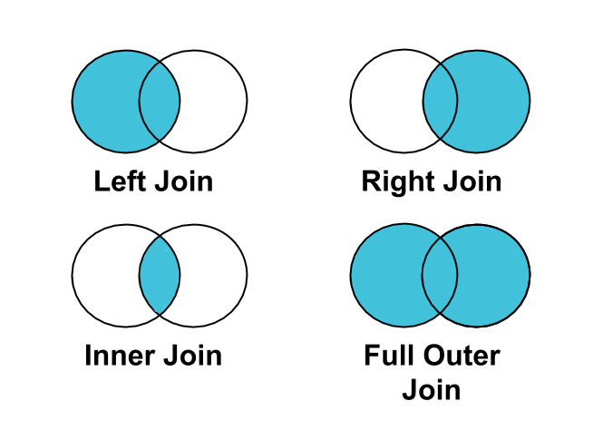

```
title: "Lecture 07 & 08: JOINS "
date: 2025-09-15
course: Microsoft SQL Server Database Administation Course
tags: [#sql-basics, #sql-queries, #sql-joins]
summary: How JOINs are used in SQL Queries and when to utilise them
```
# JOINs

Joins are fundamental to an RDBMS. They allow us to collate data in a single query whilst storing this over different places/tables. This solves the issue of previously needing to store data all in one place, spreadsheet style. Therefore performance is not impacted and you can obtain/analyse/manipulate data at will.

## JOIN syntax
```
SELECT 
t1.column1,
t2.column2,
...
FROM Table1 as t1 
JOIN Table2 as t2 on t1.column1 = t2.column1
```

The above will return a result set showing column 1 from table 1 and column 2  from table 2. This is the simplest syntax when joining 2 tables.

## Different types of JOINs

- INNER JOIN
- LEFT JOIN
- RIGHT JOIN
- FULL JOIN

The below Venn diagram outlines what data is presented in results when different joins are used in queries:



Each join returns rows comparatively with the condition set. Left join returns all values from Table A plus the rows where the condition is met from Table B. Right join is the opposite. Inner join is only where Rows match the condition set and Full Join is returning all rows from all tables.

*Examples can be demonstrated with the queries below:*

```
USE TestDB

SELECT * FROM dbo.Student
SELECT * FROM dbo.Course

SELECT * 
FROM dbo.Student S
INNER JOIN dbo.Course C ON s.RollNO = c.RollNO

SELECT * 
FROM dbo.Student S
LEFT JOIN dbo.Course C ON s.RollNO = c.RollNO

SELECT * 
FROM dbo.Student S
RIGHT JOIN dbo.Course C ON s.RollNO = c.RollNO

SELECT * 
FROM dbo.Student S
FULL JOIN dbo.Course C ON s.RollNO = c.RollNO
```
