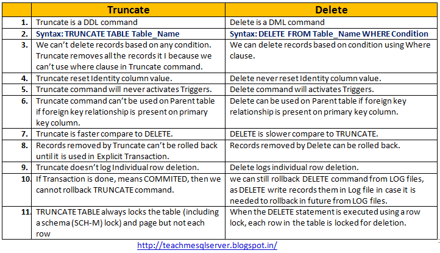

```
title: "Lecture 13: Difference between DELETE and TRUNCATE"
date: 2025-09-29
course: Microsoft SQL Server Database Administation Course
tags: [#sql-basics, #sql-queries, #sql-dml, #sql-ddl]
summary: What are the differences between DELETE and TRUNCATE.
```

# DELETE vs TRUNCATE

TRUNCATE is used to delete all rows of data from a TABLE. It differs from DELETE as you cannot define a WHERE clause.

Also, the method used to remove data differs; In a DELETE statement 1 row is removed at a time however, in a TRUNCATE statement data is removed by deallocating the data pages used to stored the table data and records only the page deallocation in the transaction log. 

The basic syntax for TRUNCATE is below:
```
TRUNCATE TABLE TableName
```

Since TRUNCATE removes data through Page deallocation, this will mean IDENTITY columns return to 1. DELETE does not have this effect and the value of the IDENTITY column is retained through DELETE.

### <u>Summarised differences between TRUNCATE & DELETE</u>
