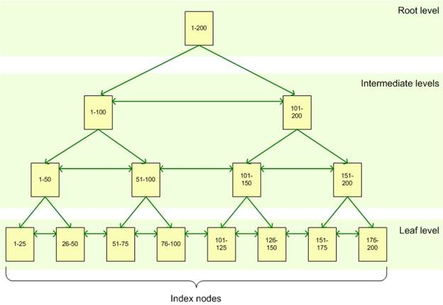

```
title: "Lecture 17: What are Indexes?"
date: 2025-10-10
course: Microsoft SQL Server Database Administation Course
tags: [#sql-basics, #sql-queries, #db-design, #sql-performance]
summary: What are the basics to indexes and how are they used?
```

# Indexes

## Why need Indexes?

Indexes are used as they provide a faster way to access specific data within a table. They can be clustered or non-clustered.

You can create indexes on most columns with the only exceptions being those configured as LOB datatypes such as: images, textm, varchar(max).

*An example:*
If you create an index on the primary key, sql will find that value first using the index and then use a key lookup to the table to return the entire row of data.

## Structure of an Index

An index is made up of a set of pages (index nodes) and are organised in a B-Tree structure (See below). This structure is hierarchal with the Root node at the top > Intermediate levels in the middle > Leaf level at the bottom.



When a query is issued against an indexed column, the query engine starts at the root node and navigates down through the intermediate nodes to the leaf nodes with each one being more granular than the one above. 