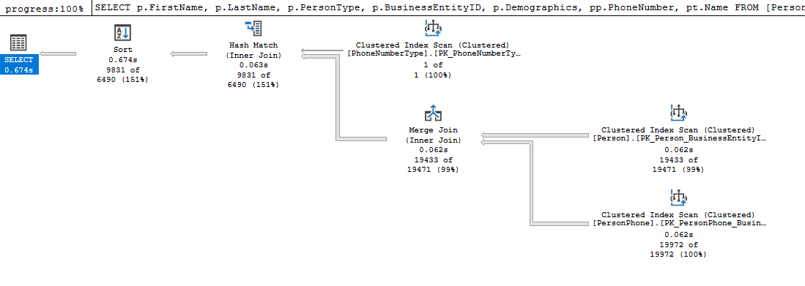
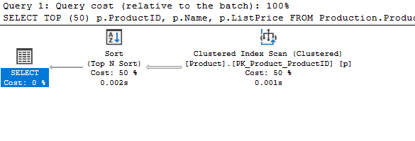

# ⚙ SQL Tuning Examples

This section of my learning Journey is dedicated to understanding the SQL server engine and the query optimizer more deeply. I will following a structure of creating a query, recording execution times and then document my process trying to optimize the query whilst also learning how my actions effect the query's performance.


## Query 1 - AdventureWorks2022

This query contains the following:

- 3 table joins
- 3 where conditions 
- An Order by

```
SQL

SELECT p.FirstName,
p.LastName,
p.PersonType,
p.BusinessEntityID,
p.Demographics,
pp.PhoneNumber,
pt.Name
FROM [Person].[Person] p
INNER JOIN [Person].[PersonPhone] pp ON p.BusinessEntityID = pp.BusinessEntityID
INNER JOIN [Person].[PhoneNumberType] pt ON pp.PhoneNumberTypeID = pt.PhoneNumberTypeID
WHERE pt.Name LIKE 'Cell'
AND p.ModifiedDate >= '2010-01-01 00:00:00.000'
AND LastName NOT LIKE 'Adams'
ORDER BY p.FirstNAME ASC
```
The executions times and query plan, before tuning, are below:

 SQL Server Execution Times:
   CPU time = 94 ms,  elapsed time = 836 ms.



1 - Asking for TOP 100 drops time (obviously):  
SQL Server Execution Times:
   CPU time = 0 ms,  elapsed time = 143 ms.

Tried creating an Index on Person.Person.FirstName including all columns in person section of the query. - No effect

Tried creating statistics on FirstName to see if this effected use of Index - No effect

***Finding this difficult will return to this query***

## Query 2 - AdventureWorks2022

This query contains the following:
- A where clause with leading wildcard
- Order by
```
SQL

SELECT TOP (50) p.ProductID, p.Name, p.ListPrice
FROM Production.Product AS p
WHERE p.Name LIKE '%mountain%'
ORDER BY p.ListPrice DESC;
```
The execution times and query plan, before tuning, are below:

 SQL Server Execution Times:
   CPU time = 0 ms,  elapsed time = 101 ms.

