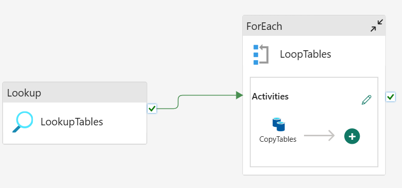
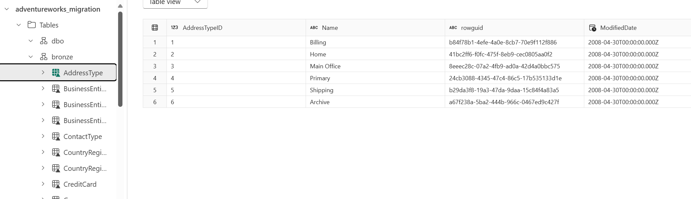

```
title: "Biztrack Migration Practical"
date: 2025-10-02
tags: [#onelake #lakehouse #data-factory #pipelines #governance #permissions #lineage #semantic-models #powerbi #dataflows-gen2]
summary: Setup and Ingestion (Bronze Layer) 
```

# Setup & Ingestion - AdventureWorks

I've completed the following so far:

- Created Lakehouse
- Created Medallions schemas
- Created pipeline to ingest tables
    - Lookup to AdventureWorks2019
    - ForEach(CopyData) to adventureworks_migration.bronze.*

Most tables have copied across into my Lakehouse Bronze schema but I have encountered 3 errors due to incompatible datatypes available in delta format. The way I will solve this will be creating a copy of all tables as views with datatypes converted to delta-safe types. Then my source will look at these views.

Currently my pipeline and lakehouse look like the following:



### Next actions:
- To restore DB to andromeda
- Create view of safe columns
- To create/move source connection to Andromeda
- Run the pipeline to copy data to Lakehouse