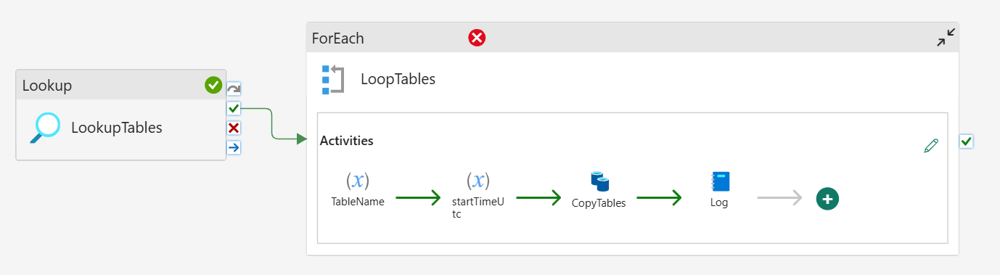
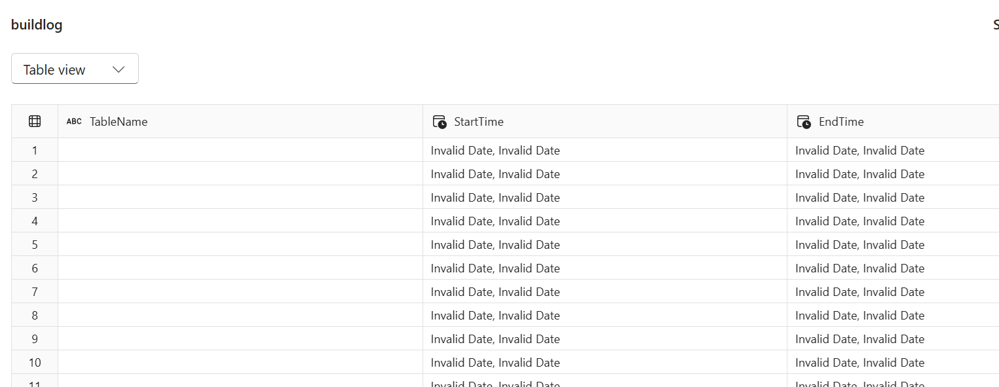

```
title: "Biztrack Migration Practical"
date: 2025-10-09
tags: [#onelake #lakehouse #data-factory #pipelines #dataflows-gen2]
summary: Setup and Ingestion - Validation/Error Handling > Cleaning & Standardisation (Silver)
```
## BMP Sessions 3

### Session aims:
- Configure validation logging to monitor runtimes.
- Implement CDC for incremental loads into tables.
- Investigate first steps into cleaning and preparing data for silver/gold.

I've setup a notebook to log the runtimes of my CopyData activity into a table called build logs. I've setup parameters at the notebook level for each of the column values and they look at variables setup earlier in the pipeline called TableName and StartTimeUtc. The variables are declared in a python cell and inserted into a temp table called run_params. These are later selected by a SQL statement in my second cell block and inserted into dbo.BuildLogs 

My pipeline currently looks like the below:


The issue currently is that the SQL statement reaches that table and inserts rows but it is not showing the correct date. The results of that table look like the below:


### Next sessions aims:

- Finish setup of runtime logging
- Implement CDC for incremental loads into tables.
- Investigate first steps into cleaning and preparing data for silver/gold.