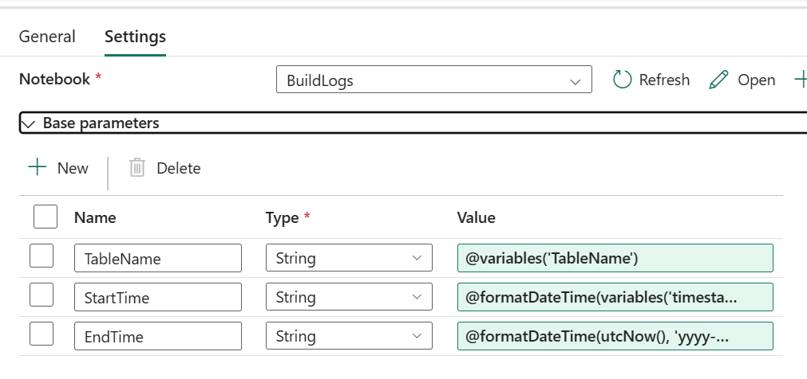

```
title: "Biztrack Migration Practical"
date: 2025-10-14
tags: [#onelake #lakehouse #data-factory #pipelines #dataflows-gen2]
summary: Setup and Ingestion - Validation/Error Handling > Cleaning & Standardisation (Silver)
```

### Session Aims:
- Finish setup of runtime logging
- Implement CDC for incremental loads into tables.
- Investigate first steps into cleaning and preparing data for silver/gold.

The pipeline is running successfully but runtimes of my 'CopyData' Activity are not being logged in my dbo.BuildLogs table. Rows are being inserted on each run but the data values from my input variables are not being recognised by my notebook.

I've set my base parameters to the following on my notebook:


The input logs for a successful run recognises data-in from the relevant tables but it is not being inserted into the build logs table. Also manually using .show() and print() I can see that these values are not present in my notebook.

The structure of my notebook currently is the following:
```
Cell 1:
=======
#Parameters Cell

# Define notebook parameters
# This cell must be at the top of the notebook

# MAGIC %run
# MAGIC param TableName=""
# MAGIC param StartTime="1970-01-01T00:00:00Z"
# MAGIC param EndTime="1971-01-01T00:00:00Z"

Cell 2:
=======
#Parameters Cell

print("TableName:", TableName)
print("StartTime:", StartTime)
print("EndTime:", EndTime)

Cell 3:
=======
row = [(
    TableName,
    StartTime,
    EndTime,
)]

cols = ["TableName",
    "StartTime",
    "EndTime"]

df = spark.createDataFrame(row, cols)

try:
    existing_logs = spark.table("run_logs")
    df.union(existing_logs).createOrReplaceTempView("run_logs")
except:
    df.createOrReplaceTempView("run_logs")

spark.sql("SELECT * FROM run_logs").show()

Cell 4:
=======
%%sql
INSERT INTO dbo.BuildLog (TableName, StartTime, EndTime)
SELECT
    TableName,
    to_timestamp(StartTime) as StartTime,
    to_timestamp(EndTime) as EndTime
FROM run_logs;
```

I will investigate further on specifically how fabric works with moving parameters around between pipelines and notebooks.

### Next session aims:
- Finish setup of runtime logging
- Implement CDC for incremental loads into tables.
- Investigate first steps into cleaning and preparing data for silver/gold.