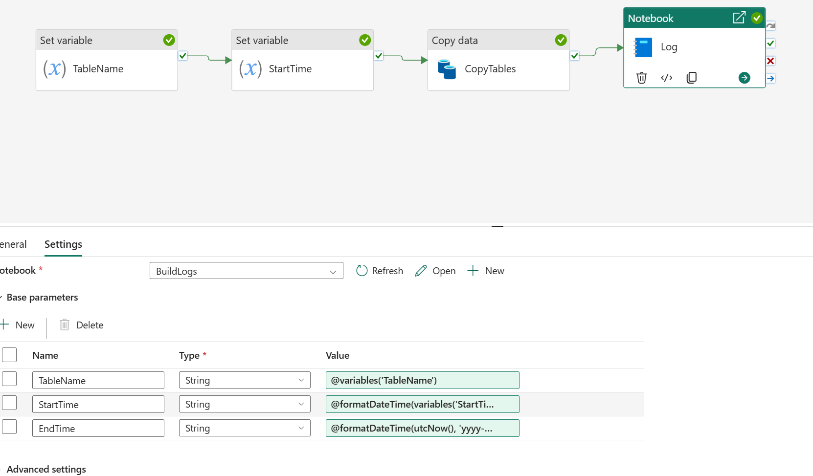

```
title: "Biztrack Migration Practical"
date: 2025-10-14
tags: [#onelake #lakehouse #data-factory #pipelines #dataflows-gen2]
summary: Setup and Ingestion - Validation/Error Handling > Cleaning & Standardisation (Silver)
```
## BMP Sessions 5

### Session Aims:
- Finish setup of runtime logging
- Implement CDC for incremental loads into tables.
- Investigate first steps into cleaning and preparing data for silver/gold.

My pipeline now runs and my build logs table is populated correctly with my run times. The issue was that my variables, base parameters and referenced columns/values did not align. All references were listed as "StartTime" but the notebook was pulling through "timestamp". I identified this by looking at the item snapshots section in "Recent runs".

The data is now populated correctly. 

The pipeline is visually unchanged but my notebook and variables/base parameters are below:

### **Notebook structure:**
```
TableName = "TableName"
StartTime = "StartTime"
EndTime = "EndTime"
```
```
row = [(
    TableName,
    StartTime,
    EndTime,
)]

cols = ["TableName",
    "StartTime",
    "EndTime"]

df = spark.createDataFrame(row, cols)

try:
    existing_logs = spark.table("run_logs")
    df.union(existing_logs).createOrReplaceTempView("run_logs")
except:
    df.createOrReplaceTempView("run_logs")

spark.sql("SELECT * FROM run_logs").show()
```
```
%%sql
INSERT INTO dbo.BuildLog (TableName, StartTime, EndTime)
SELECT
    TableName,
    to_timestamp(StartTime) as StartTime,
    to_timestamp(EndTime) as EndTime
FROM run_logs;
```

### **Parameter & Variable alignment:**


### Next Sessions aims:
- Implement CDC for incremental loads into tables.
- Investigate first steps into cleaning and preparing data for silver/gold.

