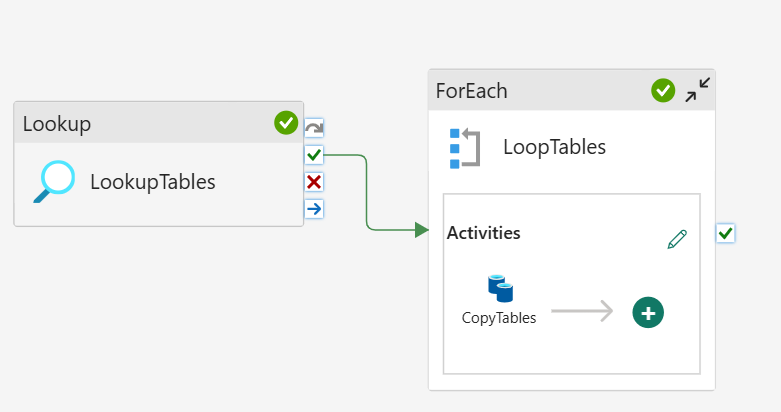

```
title: "SQL to Fabric Migration Practical"
date: 2025-10-07
tags: [#onelake #lakehouse #data-factory #pipelines]
summary: Setup and Ingestion (Bronze Layer) 
```
## SFMP Session 2

### Session aims:
- To restore DB to andromeda
- Create view of safe columns
- To create/move connection to Andromeda
- Run the pipeline to copy data to Lakehouse


I've restored the database to TDB-SQL-03 and have created a view of all tables that meet the condition 'SCHEMA IN ('Sales','Production','HumanResources','Person','Purchasing')', which converts the columns to delta-safe datatypes. After creating the new connection in Fabric, I could point the Pipeline source to these views and the destination to my 'bronze' schema in Fabric.

My pipeline ran successfully, first finding the views, and then, copying the data to my schema:



An issue I found initially was using the below inside my CopyData source activity. 
```
@item().FQTN
```
Since fabric was expecting a SQL query this is why it failed. Instead I used the below to format a query and this ran without issue.
```
@concat('SELECT * FROM ', item().FQTN)
```

### Next sessions aims:
- Configure validation logging to monitor runtimes.
- Implement CDC for incremental loads into tables.
- Investigate first steps into cleaning and preparing data for silver/gold.